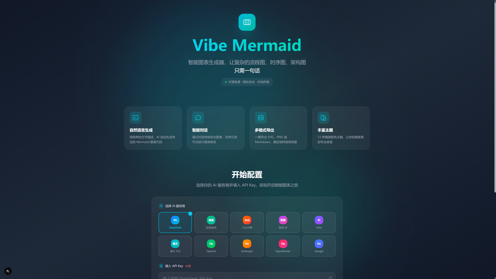
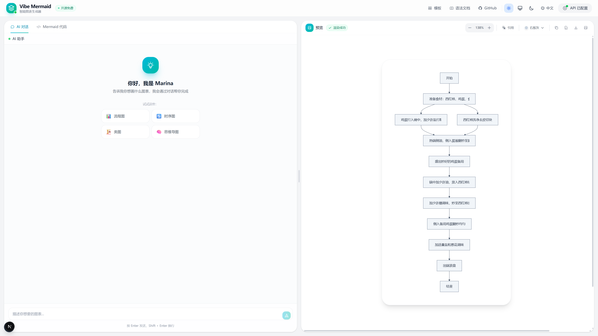

<div align="center">

# Vibe Mermaid Editor

**Transform natural language into professional diagrams with AI, supporting 10+ AI providers**

English | [简体中文](./README_ZH.md)

[](https://opensource.org/licenses/MIT)
[](https://nextjs.org/)
[](https://react.dev/)
[](https://www.typescriptlang.org/)
[](https://github.com/huangpufan/vibe-mermaid/actions/workflows/ci.yml)
[](CONTRIBUTING.md)

[Live Demo](https://mermaid-ai-six.vercel.app) · [Report Bug](https://github.com/huangpufan/vibe-mermaid/issues) · [Request Feature](https://github.com/huangpufan/vibe-mermaid/issues)

</div>

---

## 📸 Screenshots

<div align="center">

### Home Page


### Main Interface


</div>

---

## Why Vibe Mermaid Editor?

| Traditional Approach | Vibe Mermaid Editor |
|---------------------|-------------------|
| Learn Mermaid syntax | Just describe in natural language |
| Debug syntax errors manually | **AI auto-detects and fixes errors** ⚡ |
| Copy code to other tools for rendering | Real-time preview, WYSIWYG |
| Locked to one AI service | **10+ AI providers to choose from** |
| API Key uploaded to servers | **Local storage, data stays private** |

## Key Features

### 🎯 Core Advantages

- **🤖 AI Auto-Fix**: Syntax errors? No manual debugging needed - AI detects and fixes automatically
- **💬 Natural Language Generation**: Describe in English/Chinese, AI generates professional Mermaid code
- **🔄 Conversational Refinement**: Multi-turn dialogue to iteratively improve diagrams with smart suggestions
- **🎯 Interactive Node Editing**: Click any node in the diagram to reference it directly in your prompt - the AI knows exactly what you're talking about!

### 🚀 Productivity Tools

- **⚡ Real-time Preview**: Monaco Editor + Mermaid live rendering, WYSIWYG
- **⌨️ Keyboard Shortcuts**: 9+ shortcuts for efficient editing
- **🎨 12 Themes**: Beautifully designed color schemes, one-click switch
- **📤 Multiple Export Formats**: SVG vector / PNG bitmap / Markdown code

### 🔐 Security & Flexibility

- **🔒 Local Storage**: API Key stored in browser only, data stays private
- **🌐 10+ AI Providers**: OpenAI, Claude, DeepSeek, Volcengine, Zhipu AI, Kimi, and more
- **🌍 i18n Support**: English and Chinese interface

## Quick Start

### Option 1: Local Development

```bash
# Clone the repository
git clone https://github.com/huangpufan/vibe-mermaid.git
cd vibe-mermaid

# Install dependencies
npm install

# Start development server
npm run dev
```

Open [http://localhost:3000](http://localhost:3000) to use the app.

### Option 2: Deploy to Vercel

[](https://vercel.com/new/clone?repository-url=https://github.com/huangpufan/vibe-mermaid)

### Option 3: Docker Deployment

```bash
# Build the image
docker build -t vibe-mermaid .

# Run the container
docker run -p 3000:3000 vibe-mermaid
```

## User Guide

### Basic Usage

1. Click **Configure API Key** button in the top right
2. Select your AI provider (OpenAI recommended for international users)
3. Enter your API Key
4. In the **AI Chat** tab, describe your diagram:
   - "Draw a user login flowchart"
   - "Create an e-commerce order sequence diagram"
   - "Design a microservices architecture diagram"
5. Click **Generate Diagram** or press `Ctrl/Cmd + Enter`

### Conversational Refinement

After generating a diagram, continue the conversation to refine it:
- "Add a branch for login failure"
- "Add colors to each node"
- "Make the sequence diagram go from right to left"

### Interactive Node Editing

One of the most powerful features: **click nodes in the diagram to reference them directly in your prompts**!

1. Click the **Reference** button in the preview area
2. Click or select any node in the diagram - it will be automatically referenced in your prompt
3. Describe your modification naturally: "Make this node red" or "Add a connection to the database"
4. The AI understands exactly which node you're talking about - no need to describe its position or copy IDs

This makes iterative refinement incredibly intuitive - just point and describe!

## Supported AI Providers

### Chinese Providers

| Provider | Base URL | Recommended Model | Notes |
|----------|----------|-------------------|-------|
| **DeepSeek** | `https://api.deepseek.com` | deepseek-chat / deepseek-reasoner | Cost-effective, strong reasoning |
| **SiliconFlow** | `https://api.siliconflow.cn/v1` | deepseek-ai/DeepSeek-V3 | Multi-model aggregation |
| **Volcengine** | `https://ark.cn-beijing.volces.com/api/v3` | doubao-seed-1-6-251015 | By ByteDance, stable |
| **Zhipu AI** | `https://open.bigmodel.cn/api/paas/v4` | glm-4.7 | Good Chinese understanding |
| **Kimi** | `https://api.moonshot.cn/v1` | kimi-k2-thinking | Long context, reasoning |
| **MiniMax** | `https://api.minimax.chat/v1` | minimax-m2.1 | Reliable |
| **Qwen** | `https://dashscope.aliyuncs.com/compatible-mode/v1` | qwen3 / qwen-plus | By Alibaba |

### International Providers

| Provider | Base URL | Recommended Model | Notes |
|----------|----------|-------------------|-------|
| **OpenAI** | `https://api.openai.com/v1` | gpt-4.1-mini / gpt-4o | Industry standard |
| **Anthropic** | `https://api.anthropic.com/v1` | claude-sonnet-4-5-20250929 | Strong coding ability |
| **OpenRouter** | `https://openrouter.ai/api/v1` | Various models | 400+ models aggregation |
| **Google** | `https://generativelanguage.googleapis.com/v1beta/openai` | gemini-3-flash-preview | Fast and efficient |

> **Tip**: Any service compatible with OpenAI API format can be used. Just enter the corresponding Base URL and API Key.

## Keyboard Shortcuts

| Shortcut | Action |
|----------|--------|
| `Ctrl/Cmd + Enter` | Generate diagram |
| `Ctrl/Cmd + Z` | Undo |
| `Ctrl/Cmd + Shift + Z` or `Ctrl/Cmd + Y` | Redo |
| `Ctrl/Cmd + S` | Download SVG |
| `Ctrl/Cmd + Shift + S` | Download PNG |
| `Ctrl/Cmd + Shift + C` | Copy Markdown code block |
| `Ctrl/Cmd + 1` | Switch to AI Chat |
| `Ctrl/Cmd + 2` | Switch to Code Editor |
| `Ctrl/Cmd + +/-` | Zoom in/out |
| `Ctrl/Cmd + 0` | Reset zoom |

## Theme Gallery

12 beautifully designed color themes:

- **Default** - Classic blue
- **Forest** - Forest green
- **Dark** - Dark mode
- **Neutral** - Neutral gray
- **Tech Blue** - Technology blue
- **Ocean Teal** - Ocean teal
- **Sunset Orange** - Sunset orange
- **Purple Dream** - Dreamy purple
- **Rose Pink** - Rose pink
- **Emerald Green** - Emerald green
- **Amber Gold** - Amber gold
- **Slate Modern** - Modern slate

## Tech Stack

| Category | Technology |
|----------|------------|
| **Framework** | Next.js 16.1 + React 19.2 |
| **Language** | TypeScript 5 |
| **Styling** | Tailwind CSS 4 |
| **Diagrams** | Mermaid 11.12 |
| **Editor** | Monaco Editor (VS Code core) |
| **State** | Zustand 5 |
| **AI Integration** | OpenAI SDK (compatible with all OpenAI-protocol services) |
| **Testing** | Vitest 4 + Testing Library |

## Project Structure

```
src/
├── app/
│   ├── api/                    # API routes
│   │   ├── generate/           # AI diagram generation
│   │   ├── chat/               # Multi-turn conversation
│   │   ├── optimize/           # Prompt optimization
│   │   ├── suggestions/        # Code suggestions
│   │   └── chat-suggestions/   # Follow-up suggestions
│   ├── globals.css             # Global styles
│   ├── layout.tsx              # Root layout
│   └── page.tsx                # Main page
├── components/
│   ├── Editor.tsx              # Editor panel
│   ├── Preview.tsx             # Preview panel
│   ├── Header.tsx              # Top navigation
│   ├── Settings.tsx            # Settings modal
│   ├── ChatPanel.tsx           # AI chat panel
│   ├── Onboarding.tsx          # New user onboarding
│   ├── Suggestions.tsx         # Suggestions display
│   └── LanguageSwitch.tsx      # Language switcher
└── lib/
    ├── store.ts                # Zustand state management
    ├── mermaid.ts              # Mermaid utilities
    ├── useKeyboardShortcuts.ts # Keyboard shortcuts
    └── i18n/                   # Internationalization
        ├── index.ts
        ├── zh.ts               # Chinese
        └── en.ts               # English
```

## FAQ

<details>
<summary><b>Is my API Key secure?</b></summary>

Yes. Your API Key is stored only in your browser's localStorage and is never uploaded to any server. All AI requests are sent directly from your browser to the AI provider.
</details>

<details>
<summary><b>What diagram types are supported?</b></summary>

All Mermaid diagram types are supported: flowcharts, sequence diagrams, class diagrams, state diagrams, ER diagrams, Gantt charts, pie charts, Git graphs, mind maps, and more.
</details>

<details>
<summary><b>How do I add a new AI provider?</b></summary>

Any provider compatible with OpenAI API format can be used. Select "Custom" in settings and enter the Base URL and API Key.
</details>

<details>
<summary><b>What if the diagram shows garbled text?</b></summary>

Try switching to a different theme, or manually adjust font settings in the code.
</details>

## Contributing

Contributions are welcome! Please see [CONTRIBUTING.md](./CONTRIBUTING.md) for details.

Ways to contribute:
- Submit Issues to report bugs or suggest features
- Fork the project and submit Pull Requests
- Improve documentation and translations
- Share with others

## Star History

If this project helps you, please give it a Star!

[](https://star-history.com/#huangpufan/vibe-mermaid&Date)

## License

This project is licensed under the [MIT License](./LICENSE).

### What does this mean?

✅ **You can**:
- Use commercially
- Modify the code
- Distribute
- Use privately
- Sublicense

⚠️ **You must**:
- Include the original license and copyright notice

❌ **Limitations**:
- No liability
- No warranty

For Chinese version of the license, see [LICENSE_ZH.md](./LICENSE_ZH.md).

---

**Copyright (c) 2025 huangpufan**

## Acknowledgments

- [Mermaid](https://mermaid.js.org/) - Excellent diagram generation library
- [Monaco Editor](https://microsoft.github.io/monaco-editor/) - The editor core of VS Code
- [Mermaid Live Editor](https://mermaid.live/) - Official editor, inspiration for this project

---

<div align="center">

**If you find this useful, please give it a Star!**

Made with ❤️ by [huangpufan](https://github.com/huangpufan)

</div>
